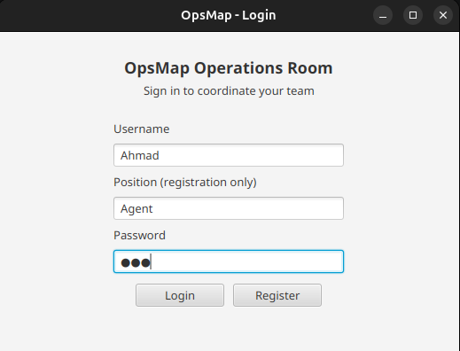
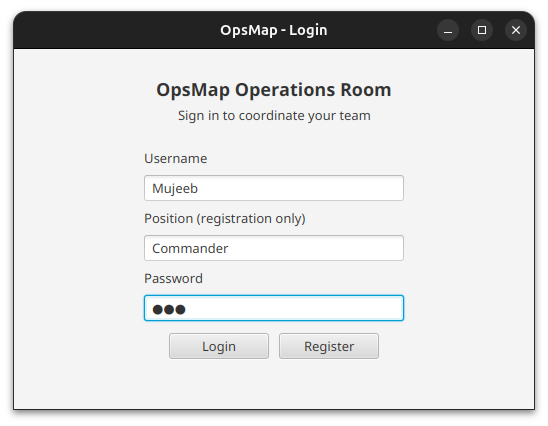
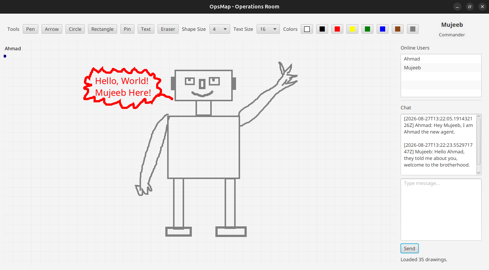

<div align="center">

# 🎨 Collaborative Real-Time Drawing System

### A real-time multi-user drawing application built with Java, JavaFX, and TCP Sockets

<br>

[](https://www.java.com/)
[](https://openjfx.io/)
[](https://maven.apache.org/)
[](#-architecture)

</div>

---

## 📸 Preview

<table>
<tr>

<td width="50%" align="center">

### 🔐 Client Login



</td>

<td width="50%" align="center">

### 👥 Second Client



</td>

</tr>
</table>

<br>

<div align="center">

### 🎨 Collaborative Workspace



</div>

---

## ✨ Features

* 🎨 **Real-time collaborative drawing**
* 👥 **Multiple simultaneous users**
* 🔐 **Registration & authentication**
* 🌐 **TCP socket communication**
* 🔄 **Real-time drawing synchronization**
* 📍 **Live pointer updates**
* 💬 **Real-time chat**
* 👤 **Live connected-user list**
* 🖌️ **Multiple drawing tools**
* 🎨 **Multiple colors and brush thicknesses**
* 📝 **Text annotations**
* 🧹 **Eraser support**
* 🖥️ **JavaFX desktop interface**

---

# 🏗️ Architecture

The application follows a **client/server architecture**.

```text
                         ┌─────────────────────┐
                         │      CLIENT 1       │
                         │      JavaFX UI      │
                         └──────────┬──────────┘
                                    │
                                    │ TCP Socket
                                    ▼
                    ┌─────────────────────────────┐
                    │           SERVER            │
                    │                             │
                    │   Authentication            │
                    │   Connected Users           │
                    │   Drawing State             │
                    │   Message Broadcasting      │
                    └──────────────┬──────────────┘
                                   │
                         ┌─────────┴─────────┐
                         │                   │
                        TCP                 TCP
                         │                   │
                         ▼                   ▼
                ┌────────────────┐   ┌────────────────┐
                │    CLIENT 2    │   │    CLIENT 3    │
                │    JavaFX UI   │   │    JavaFX UI   │
                └────────────────┘   └────────────────┘
```

The server maintains the shared drawing state and broadcasts updates to connected clients.

The server currently uses port **5050** by default and creates a dedicated `ClientHandler` thread for each incoming socket connection.

---

# 🔄 Real-Time Synchronization

When a user performs a drawing operation:

```text
       User Action
            │
            ▼
      JavaFX Client
            │
            │ DrawingOperation
            ▼
       TCP Socket
            │
            ▼
          Server
            │
       ┌────┴─────┐
       │          │
 Update State   Broadcast
       │          │
       │      ┌───┼───┐
       │      ▼   ▼   ▼
       └──── Client Client Client
```

Drawing operations are stored by the server and broadcast to connected clients. When a new user authenticates, the server sends the current drawing state so the client can reconstruct the existing workspace.

---

# 🎨 Drawing Tools

The drawing workspace provides several tools:

```text
┌─────────────────────────────────────────┐
│                 TOOLS                   │
├─────────────────────────────────────────┤
│                                         │
│  ✏️ Pen        ➜ Arrow                  │
│  ○ Circle      ▢ Rectangle              │
│  📍 Pin        T Text                   │
│  🧹 Eraser                              │
│                                         │
└─────────────────────────────────────────┘
```

Users can also select:

* 🎨 Drawing color
* 📏 Line thickness
* 🔤 Text size

The JavaFX controller implements pen, arrow, circle, rectangle, pin, text, and eraser interactions, along with a grid-based drawing workspace.

---

# 💬 Communication

The application uses a shared message model between the client and server.

```text
                    Message
                       │
        ┌──────────────┼──────────────┐
        │              │              │
        ▼              ▼              ▼
   Authentication   Drawing        Real-Time
                    Operations      Updates
                                       │
                              ┌────────┴────────┐
                              ▼                 ▼
                           Chat             Pointer
```

The server handles authentication, drawing additions/removals, chat messages, pointer updates, and user-list synchronization.

---

# 🔐 Authentication

```text
              ┌──────────────┐
              │    Client    │
              └──────┬───────┘
                     │
                     │ Auth Request
                     ▼
              ┌──────────────┐
              │    Server    │
              └──────┬───────┘
                     │
              ┌──────┴──────┐
              │             │
           Success        Failure
              │             │
              ▼             ▼
        ┌──────────┐     Error
        │ Workspace│
        └──────────┘
```

The server supports both registration and login, prevents duplicate active logins, and sends the initial workspace state after successful authentication.

---

# 🧩 Project Structure

```text
collaborative-realtime-drawing-system/
│
├── pom.xml
│
└── src/
    └── main/
        │
        ├── java/
        │   └── opsmap/
        │       │
        │       ├── client/
        │       │   ├── ClientConnection.java
        │       │   ├── LoginController.java
        │       │   ├── OperationsController.java
        │       │   └── OpsMapClientApp.java
        │       │
        │       ├── server/
        │       │   ├── ClientHandler.java
        │       │   └── OpsMapServer.java
        │       │
        │       └── shared/
        │           ├── AuthRequest.java
        │           ├── AuthResponse.java
        │           ├── ChatMessage.java
        │           ├── ColorData.java
        │           ├── DrawingOperation.java
        │           ├── MapState.java
        │           ├── Message.java
        │           ├── MessageType.java
        │           ├── PointData.java
        │           ├── PointerUpdate.java
        │           ├── ToolType.java
        │           └── UserList.java
        │
        └── resources/
            └── fxml/
                ├── login.fxml
                └── operations.fxml
```

The repository separates the application into `client`, `server`, and `shared` packages.

---

# 🛠️ Technology Stack

| Technology            | Purpose                         |
| --------------------- | ------------------------------- |
| ☕ **Java 25**         | Core programming language       |
| 🎨 **JavaFX 25**      | Desktop graphical interface     |
| 🌐 **TCP Sockets**    | Client/server networking        |
| 📦 **Maven**          | Build and dependency management |
| 🧩 **FXML**           | JavaFX UI layouts               |
| 🧵 **Java Threads**   | Handling concurrent clients     |
| 📡 **Object Streams** | Message serialization           |

The Maven configuration targets Java 25 and JavaFX 25 and uses the JavaFX Controls and FXML modules.

---

# 🚀 Getting Started

## 1. Clone

```bash
git clone https://github.com/Mujeebmominyar/collaborative-realtime-drawing-system.git

cd collaborative-realtime-drawing-system
```

## 2. Check Java

```bash
java --version
```

The project targets **Java 25**.

## 3. Check Maven

```bash
mvn --version
```

## 4. Build

```bash
mvn clean package
```

---

# ▶️ Running the Application

## Start the Server

Run:

```text
opsmap.server.OpsMapServer
```

The default port is:

```text
5050
```

A custom port can also be supplied as a command-line argument.

```bash
java ... opsmap.server.OpsMapServer 5051
```

The server continuously accepts incoming connections and creates a separate handler thread for each client.

---

## Start the Client

The JavaFX application entry point is:

```text
opsmap.client.OpsMapClientApp
```

Or use Maven:

```bash
mvn javafx:run
```

The Maven configuration already specifies `opsmap.client.OpsMapClientApp` as the JavaFX main class.

---

# 👥 Multi-Client Testing

Start **one server**, then launch multiple client instances.

```text
                         SERVER :5050
                              │
               ┌──────────────┼──────────────┐
               │              │              │
               ▼              ▼              ▼
           Client 1       Client 2       Client 3
             Alice           Bob          Charlie
               │              │              │
               └──────────────┼──────────────┘
                              │
                       Shared Workspace
```

### Example

1. Start the server.
2. Launch Client 1.
3. Launch Client 2.
4. Register/login with different users.
5. Draw on Client 1.
6. Observe the drawing appear on Client 2.
7. Test chat and pointer synchronization.

---

# 🧠 What This Project Demonstrates

This project provides practical experience with:

* Object-Oriented Programming
* JavaFX desktop development
* FXML
* TCP/IP networking
* Socket programming
* Multithreading
* Client/server architecture
* Real-time state synchronization
* Authentication
* Serialization
* Event-driven programming
* Shared application state

---
<div align="center">

# 🎨 Draw Together. Build Together.

#### Author:

### 👨‍💻 Mujeeb Mominyar

Computer Engineering

Amirkabir University of Technology

<br>

<a href="https://github.com/Mujeebmominyar">


</a>

<br><br>

<a href="https://github.com/Mujeebmominyar">
View my GitHub profile →
</a>

</div>
